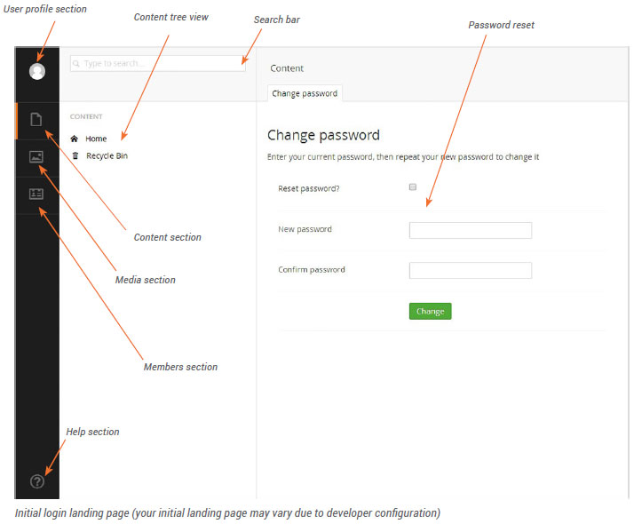
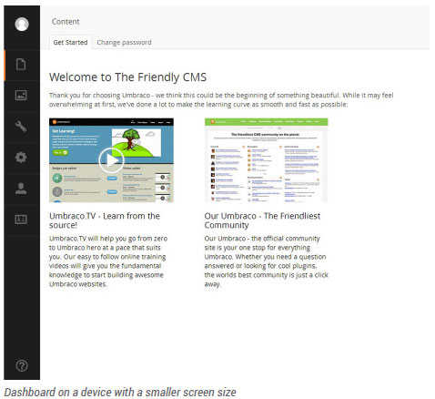
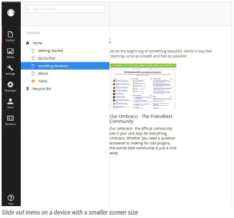

###2. Umbraco Interface##

####2.1 Struktur og første indtryk

Når du er logget ind, vil du starte i 'Content' sektionen i Umbraco. Der er adskillige sektioner i Umbraco der giver et overblik over de forskellige aspekter af siden. 'Content' sektionen giver dig mulighed for at styre de forskellige undersider på din hjemmeside.
Sektioner kan være forskellige fra bruger til bruger, afhængiet af deres rolle i systemet. F.eks. Som en redaktør eller en skribent, har du kun adgang til 'Content' og 'Media' sektionerne. Du kan navigere rundt mellem sektionerne, ved at bruge den sorte sektions bar i venstre side af skærmen. Når du holder over en af sektionerne, navnet af den gældende sektion vil blive vist. Klik på en sektion for at gå til denne.

I højre side af sektions-baren kan du se et træ system med rødder, der viser strukturen på din hjemmeside. For at navigere i dette rod system, kan du klikke på de sorte pile til venstre i elementerne, hvilket vil vise alle undersiderne. Hvis du klikker på et navn til en af disse sider, vil den indlæse sidens indhold i det store indholdsområde i højre side.

 

####2.2  Opførsel på mindre skærm størrelser

Per standard på en desktop computer med en større skærm, vil rod-systemet altid være synligt, således det giver hurtigt adgang til at vælge og navigerer i indholdet. På mindre skærme såsom på bærbare og tablets, vil rod-systemet være lukket og åbnes først når du klikker på en af navigitions ikonerne i selektions-baren i venstre side af skærmen.

Efter at have valgt et element under rod-systemet på en mindre skærm, vil det automatisk lukkes for at spare på skærmpladsen. Hvis du ønsker at lukke rod-systemet uden at vælge en side, kan du flytte musen ud fra rod-systemet, eller alternativt kan du på et touch system, såsom på en mobil, swipe til venstre over rod-systemet. Herunder kan du se nogle eksempler på hvordan sådan et interface kan se ud på en tablet.
    

