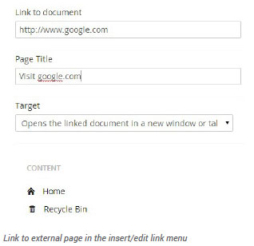
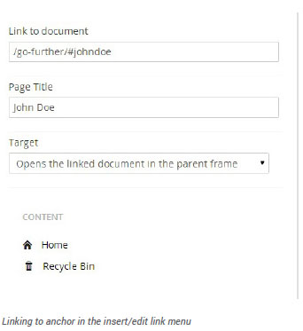
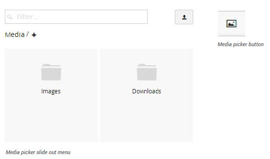
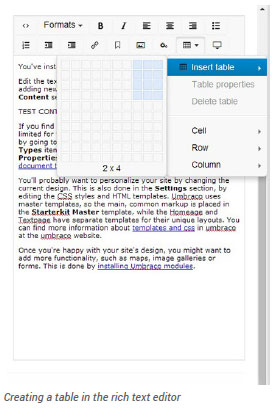
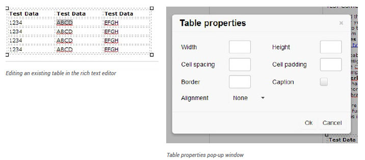

###1. Rich Text Editor

Umbracos Rich Text Editor er det felt, hvor du som redaktør kan være kreative. Du vælger selv, hvor meget du vil lave selv. Du kan arbejde på tekstindhold, formatere teksten, eller blot lade det være som det er. Hvis du ønsker at gøre mere, kan du indsætte billeder, oprette tabeller eller oprette links til andre sider eller dokumenter.

Funktionaliteten varierer afhængigt af, hvordan editoren er sat op. Her beskriver vi standard editoren med alle muligheder aktiveret. Kontakt systemadministratoren for at få oplysninger om din editor.

####1.1 Editor Knapper

Nedenfor er alle standard editor knapperne til rådighed. Din systemadministrator er i stand til at bestemme, hvilke knapper der vises i forskellige skabeloner. Du kunne derfor have adgang til flere eller færre knapper end dem der er vist her.
 

####1.2 Afsnit brydelse / linjeskift

Redaktøren er ligesom alle andre tekstbehandlingsprogram. Du skriver teksten, og teksten ombrydes omkring når linjen når slutningen. Når du trykker på ENTER i editoren, får du en paragraf pause, hvilket betyder, at der er plads mellem afsnittene. Hvis du ikke ønsker et mellemum, skal du lave et linjeskift i stedet. Det gør du ved at trykke på SHIFT+ENTER.

####1.3 Genvejstaster

For at gøre dit arbejde lettere, er der genvejstaster til bestemte redaktør funktioner. Genvejstaster lader dig bruge tastaturet til at udføre bestemte kommandoer.

Genvej | Handling
------------- | ------------
Ctrl + A | Vælg alle
Ctrl + B | Fed skrift
Ctrl + C | Kopier
Ctrl + I | Kursiv skrift
Ctrl + U | Understreget skrift
Ctrl + V | Sæt ind
Ctrl + X | Klip
Ctrl + Y | Gendan
Ctrl + Z | Fortryd

####1.4 Tekst formattering

Du behøver normalt ikke at bruge meget tid på at formatere tekst, fordi Umbraco tager sig af en masse formatering for dig. Når standardformateringen dog ikke er nok er der en række muligheder for at kontrollere formateringen af teksten.

**Formaterings Knapper**

Den mest grundlæggende og formentlig den mest kendte måde at kontrollere formateringen er via formaterings knapperne. Disse fungerer meget lig dem som, findes i de fleste tekstbehandlingsprogrammer såsom Microsoft Word. Med disse kan du anvende simpel formatering såsom fed, kursiv og understregning samt ændre tekst placering og skabe punkt- og nummererede lister.

Uanset hvilken formatering, der anvendes, er processen for at anvende et format ved hjælp af formatering knapper er altid den samme.

1. Vælg den tekst, du ønsker at anvende formatering på.
2. Klik på den relevante format knappen for at anvende den formatering, du ønsker at tilføje.
 

**Formater**

En anden måde at anvende formatering er via Formater rullelisten. Format rullelisten indeholder et sæt foruddefinerede stilarter, der kan anvendes til tekst og samtidig bevare et ensartet udseende gennem webstedet. Disse stilarter indeholder ofte mere avanceret formatering funktionalitet, som kan anvendes til at give et anderledes udseende for visse elementer, såsom links, overskrifter og underoverskrifter. For eksempel kan du bruge en format-stil til at ændre et link til en call-to-action knap. Mens de stilarter der er til rådighed på dit websted kan variere, er processen for at anvende typografier er altid den samme.

1. Vælg den tekst, du ønsker at anvende typografien på.
2. Vælg den stil at gælde fra Format rullelisten.

**Kopiering indhold fra andre programmer**

Det er vigtigt at bemærke, at når du på forhånd skriver indhold til senere at blive kopieret ind i en rich text editor, kan du støde stil problemer på din hjemmeside. Når du indsætter indhold, vil de oprindelige teksttypografier bevares,, hvilket kan føre til forskellige skrifttyper, størrelser og farver fra det, der forventes, når hjemmesiden vises. For at forhindre dette sker rådes der til at du indsætter indholdet i en markdown editor først, såsom notesblok, derefter kopiere og indsætter den derfra ind i din rich text editor.

**Fjern formattering**

Hvis du har formateret et afsnit eller en markering ved hjælp af formaterings knapperne, kan du fjerne en formatering ved at markere teksten og klikke på relevante formatering knap for at fjerne denne formatering. Du har muligvis også en 'fjern format' knap i din værktøjslinje. Hvis du ikke har denne knap, bedes du tale med din systemadministrator.
*Fjern formatterings knappen*
 

###1.5 Vis/Gem HTML kode
 

Hvis du er godt inde i brugen af HTML kan du skifte til HTML-tilstand og oprette din side ved at skrive HTML-kode. Du kan også tjekke koden og foretage mindre justeringer her for at få siden præcis som du ønsker det. Visse elementer som scripts vil ikke blive tilladt, og vil blive filtreret ud af kode i rich text editoren.

####1.6 Links
 

Knappen ***Indsæt link*** bruges til at oprette links til interne og eksterne sider og mediefiler såsom, email links og ankre. Processen for at indsætte et hyperlink varierer afhængigt af typen af hyperlink, du ønsker at oprette.

**Link til en side på en anden hjemmeside**

1. Marker den tekst, der skal fungere som et hyperlink.
2. Klik på knappen ***Indsæt link***, som vil afsløre linkets egenskaber i glid-ud menuen.
3. I feltet URL, indtast webadressen på den webside du ønsker at linke til.
4. I feltet Title/Titel, indtast den tekst, der vil blive vist som en pegepind til linket. Dette er vigtig information for alle der læser hjemmesiden med forskellige hjælpemidler.
5. I feltet Target/Mål skal du vælge målvinduet/ramme og vælg derefter, hvordan skal åbnes. Der er tre forskellige måder linket kan åbnes:
  1. Åbn link i en ny fane i det samme browservindue.
  2. Åbn link i et nyt separat browservindue.
  3. Åbn linket i den samme browser fane som brugeren bruger til visning af dit websted.
6. Klik ***Vælg.*** Din tekst vil nu indeholde et link som anmodet.

**Link til en Side i Umbraco**
 
1. Marker den tekst, der skal fungere som et hyperlink.
2. Klik på ***Indsæt link*** knappen, som vil afsløre linkets egenskaber i glid-ud menuen.
3. Vælg en side fra ***Indhold*** baren at linke til. Dette vil så udfylde **link til dokumentet** automatisk.
4. I feltet Side Titel/Navn, indtast den tekst, der vil blive vist som en pegepind til linket. Dette er vigtig information for alle der læser hjemmesiden med forskellige hjælpemidler, (som standard vil navnet på den valgte side automatisk indtastes for din bekvemmelighed).
5. I ***Mål*** feltet, skal du vælge målvinduet/ramme som linket skal åbnes i.
6. Klik ***Vælg***.

**Link til en Mediefil i Umbraco**

1. Marker den tekst, der skal fungere som et hyperlink.
2. Klik på ***Indsæt link*** knappen, som vil afsløre linkets egenskaber i glid-ud menuen.
3. Vælg ***link til fil*** knappen, som er placeret i bunden af glid-ud menuen.
4. Du vil herefter blive taget til medie vælgeren, hvor du kan vælge et medie element.
5. Når du har valgt medie emnet, vil du blive taget tilbage til link-vinduet, hvor linket til dokumentet og side titel felterne er befolket med medie elementets oplysninger. Som standard vil sidens titel vil være det samme som mediets filnavn, men dette kan redigeres.
6. I ***Mål*** feltet, skal du vælge målvinduet / ramme som linket skal åbnes i.
7. Klik på Vælg.

**Link en e-mail adresse Umbraco**

1. Marker den tekst, der skal fungere som et hyperlink.
2. Klik på ***Indsæt link*** knappen, som vil afsløre linkets egenskaber i glid-ud menuen.
3. I feltet URL, indtastes teksten ***mailto:*** efterfulgt af e-mail-adresse, du ønsker at linke til (f.eks mailto: name@company.com).
4. I feltet Titel, indtast den tekst, der vil blive vist som en pegepind til linket. Dette er vigtig information for alle der læser hjemmesiden med forskellige hjælpemidler.
5. I ***Mål*** feltet, skal du vælge målvinduet / ramme som linket skal åbnes i.
6. Klik ***Vælg.***

**Link til et anker på samme side**

Med et anker kan du oprette interne side links, der giver brugerne mulighed for at navigere indeni en side. Der er to dele til at oprette et anker; ankeret selv og linket til ankeret.

**Oprettelse af et anker**

1. Fokuser redaktøren markøren hvor du ønsker at oprette ankeret.
2. Klik på

 hvilket derefter vil starte anker skabelses dialogen.
3. I navnefeltet indtastes dit anker navn. Du bør undgå specialtegn og ikke bruger mellemrum.
4. Klik ***OK*** for at afslutte.
5. Du vil se et lille anker-ikon, hvor du tidligere har haft redaktøren markøren.

For at slette ankeret, skal du blot vælge det og derefter trykke på din delete tast.
  

**Link til et anker**

1. Fremhæv det indhold, som du ønsker at tilføje anker linket til.
2. Klik på ***Indsæt link*** knappen, som vil afsløre linkets egenskaber i glid-ud menuen.
3. Tilføj et hashtag symbol efterfulgt af navnet på dit anker i **link til dokument*** feltet.
4. Klik ***Vælg.***

**Opret et link fra et billede**

Du kan lave billeder til klikbare links i Umbraco.

1. Indsæt et billede i editoren (se Arbejde med billeder for flere detaljer).
2. Vælg det billede, der vil fungere som et hyperlink.
3. Herfra følges de samme instruktioner som for indsætning af et normalt link, der starter ved trin 2.

**Fjernelse af link**

1. For at fjerne et link, er du først nødt til at vælge det i editoren. For tekst links klik blot på markøren hvor som helst inden i linkteksten. For et billede skal du blot klikke på billedet selv.
2. Klik på **Fjern Link** knappen, som fjerner hyperlinket. Hvis Fjern link knappen ikke er i din rich text editor i værktøjslinjen skal du i stedet klikke på **Indsæt / rediger link** knappen igen og manuelt fjerne linket fra linket-til-dokument tekstfeltet.

#### 1.7 Arbejde med billeder

For at vise billeder på en side, skal de uploades til dit Umbraco mediebibliotek. Mange organisationer opretter et mediebibliotek, der indeholder billeder, som redaktørerne kan bruge på deres sider. Andre giver deres redaktører gratis brug af deres egne billeder. Proceduren for at uploade et billede varierer lidt afhængigt af hvilken metode din organisation har vedtaget, så tjek med din systemadministrator hvad der er gældende i din organisation.

**Indsættelse af et billede fra mediebiblioteket**

1. Placer markøren i redigeringsvinduet, hvor du vil indsætte dit billede.
2. Klik på ***Media Picker/Medie vælger*** knappen fra værktøjslinjen for at åbne medie-vælger menuen.
3. Vælg den mappe, som billedet er i.
4. Klik på miniaturen af dit valgte billede for at åbne menuen billedegenskaber.
5. I feltet Titel, indtast et navn / beskrivelse af billedet (som standard vil navnet på filen automatisk indtastes for din bekvemmelighed). Det er vigtigt at tilføje beskrivende titler til billeder som disse, da de bruges til at hjælpe synshandicappede brugere.
6. Klik ***Indsæt*** for at tilføje billedet.

**Indsættelse af et billede fra din computer**

Du kan uploade billeder direkte fra rich text editoren på den side du redigerer. Disse billeder vil blive gemt i Umbracos mediebibliotek. Derfor bør der drages omsorg for at sikre, at billedet er placeret i den korrekte placering i biblioteket. Hvis du klikker på plus-ikonet under søgefeltet i medierne picker glide ud menu kan du oprette mapper i mediebiblioteket.

1. Placer markøren i redigeringsvinduet, hvor du vil indsætte dit billede.
2. Klik på ***Media Picker/Medie vælger*** knappen fra værktøjslinjen for at åbne medie-vælgeren.
3. Klik på knappen ***Upload*** som er placeret i øverste højre hjørne af menuen.
4. Vælg det valgte billede fra pop-up-vinduet.
5. I feltet Titel, indtast et navn / beskrivelse af billedet. (Som standard vil navnet automatisk blive indtastet for din bekvemmelighed).
6. Klik ***Indsæt*** for at tilføje billedet.

**Slet et billede fra side**

Hvis du vil slette et billede fra siden, skal du blot vælge billedet, og tryk på knappen ***Delete*** på tastaturet. Billedet forsvinder fra siden, men er ikke slettet fra Umbraco mediebibliotek.

#### 1.8 Makroer

I Umbraco, er makroer er små byggesten af funktionalitet, der kan blive smides i en editor. Hver makro omfatter et stykke af funktionalitet og giver en enkel grænseflade til at kunne ændre makroen til dine behov. En makro kan være alt fra en kontaktformular til en integrerbar medieafspiller. Fordelen ved makroer er, at det giver redaktører mulighed for at føje komplekse elementer til siden på en simpel måde.

De makroer der er til rådighed for dig afviger fra system til system, så spørg din systemadministrator for at finde ud af, hvilke makroer er tilgængelige for dig, og hvad de gør. Fremgangsmåden for tilføjelse og opdatering af en makro er altid den samme.

**Tilføjelse af en Makro til side**

1. Placer markøren i redigeringsvinduet, hvor du vil indsætte din makro.
2. Klik på ***Indsæt Macro*** knappen fra værktøjslinjen for at åbne makro-dialogboksen.
3. Vælg en makro til at indsætte fra Vælg en makro drop-down listen.
4. Konfigurer makroen efter behov.
5. Klik ***Vælg*** for at indsætte makroen.
6. Makroen vises i editoren med gul stiplet kant.

**Redigering af makroer**

Du kan redigere værdier, du har indtastet i en makro, efter at det er blevet føjet til din rich text editor.

1. Fremhæv makroen i rich text editoren.
2. Klik på ***Makro*** på værktøjslinjen.
3. Dette vil bringe konfiguration glid-ud menuen ud, hvor du kan redigere tidligere tilføjede værdier.

### Fjernelse af makroer

Hvis du vil fjerne en makro skal du blot markere makroen i rich text editoren og tryk på ***Delete*** eller ***Backspace*** knappen på dit tastatur.

#### 1.9 Tabeller

Tabeller bruges til at formatere information i et gitter struktur. Når du indsætter en tabel, vælger du, hvor mange rækker og kolonner tabellen skal bestå af, samt udfyldelse af en række yderligere valgfrie formaterings egenskaber. Disse værdier kan ændres senere, så det er ikke vigtigt at vide præcis, hvordan din tabel skal se ud når du opretter den. 

**Redigering af en eksisterende tabel**

For at redigere en tabel efter du allerede har oprettet den, skal du klikke på den, så du har en lille firkantet kasse i hver af de fire hjørner. Derefter skal du klikke på ***Tabel*** knappen i rich text editoren for at vise muligheder.

Ved at klikke på ***Egenskaber for Tabel*** gives der flere muligheder for at ændre tabellens udseende, men udvikleren af hjemmesiden har måske allerede oprettet tabelstile for dig, så du behøver måske ikke at justere disse indstillinger. Der er forskellige andre muligheder for at modificere celler, rækker og kolonner såsom højde, tilpasning, sammensmeltning, indsættelse og sletning.

